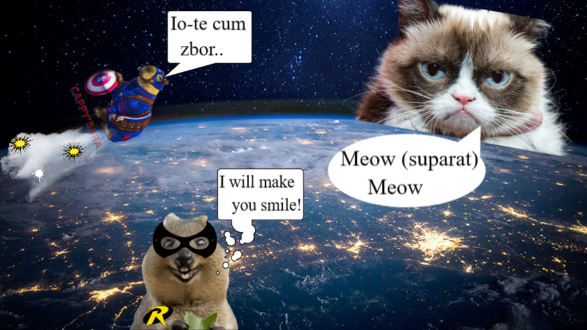

# Grumpy Wants To Conquer The World

After his brave deeds in Paris, the capybara received a portion of the cheese as a reward, eating it all immediately. However, his short memory proved him, because he forgot that he was lactose intolerant. 
Now he flies on orbit... Giving Grumpy a chance to put his evil plan into action, conquer the world and make everyone grumpy.
But, luckily, Capybara's helper, Quokobin, is ready and will show Grumpy what it means to smile from ear to ear :grin:. The fight that emerges between this two is something unprecedented, Grumpy even getting to use Quokobin's supreme weakness, The Bread!! 
However, thanks to Big Floppa and her appetite, right after she finishes eating all the bread, Quokobin manages to defeat Grumpy and send him to his worst nightmare, The Cat Cafe Prison, where everyone smiles when they see them.

## Characters

- [Capybara](./../heroes/Capybara.md)
- [Quokobin](./../heroes/Quokobin.md)
- [Big Floppa](./../heroes/BigFloppa.md)
- [Grumpy Cat](./../villains/GrumpyCat.md)